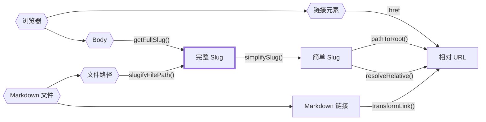

路径相当复杂,尤其对于静态站点生成器来说,因为它们可能来自很多地方。

一个内容的完整文件路径?也是一个路径。内容的 slug 呢?又是另一个路径。

将这些都简单地定义为 `string` 类型并不明智,因为很容易不小心把一种路径类型误认为另一种。不幸的是,TypeScript 对类型别名没有[名义类型](https://en.wikipedia.org/wiki/Nominal_type_system),这意味着即使你为服务器端 slug 或客户端 slug 创建了自定义类型,你仍然可以不小心将一个分配给另一个,而 TypeScript 不会捕获到。

幸运的是,我们可以使用[品牌](https://www.typescriptlang.org/play#example/nominal-typing)来模拟名义类型。

```typescript
// 不要这样做
type FullSlug = string

// 而是这样做
type FullSlug = string & { __brand: "full" }

// 这样,以下代码将无法通过类型检查
const slug: FullSlug = "some random string"
```

虽然这可以防止在我们的名义类型系统_内部_出现大多数类型错误(例如,将服务器 slug 误认为客户端 slug),但它不能防止我们在强制转换时_意外地_将字符串误认为客户端 slug。

因此,我们仍然需要在"入口点"处小心将字符串转换为这些名义类型之一,在下图中用六边形形状表示。

下图展示了所有路径来源、名义路径类型以及 `quartz/path.ts` 中哪些函数在它们之间进行转换的关系。



以下是主要 slug 类型的粗略描述:

- `FilePath`: 磁盘上文件的真实文件路径。不能是相对路径,必须有文件扩展名。
- `FullSlug`: 不能是相对路径,不能有前导或尾随斜杠。它可以有 `index` 作为最后一段。在任何可能的情况下都使用这个,因为它是对 slug 最"通用"的解释。
- `SimpleSlug`: 不能是相对路径,不应该有 `/index` 作为结尾或文件扩展名。但是它_可以_有一个尾随斜杠来表示文件夹路径。
- `RelativeURL`: 必须以 `.` 或 `..` 开头以表示它是相对 URL。不应该有 `/index` 作为结尾或文件扩展名,但可以包含尾随斜杠。

要更清楚地了解它们之间的关系,请查看 `quartz/util/path.test.ts` 中的路径测试。
