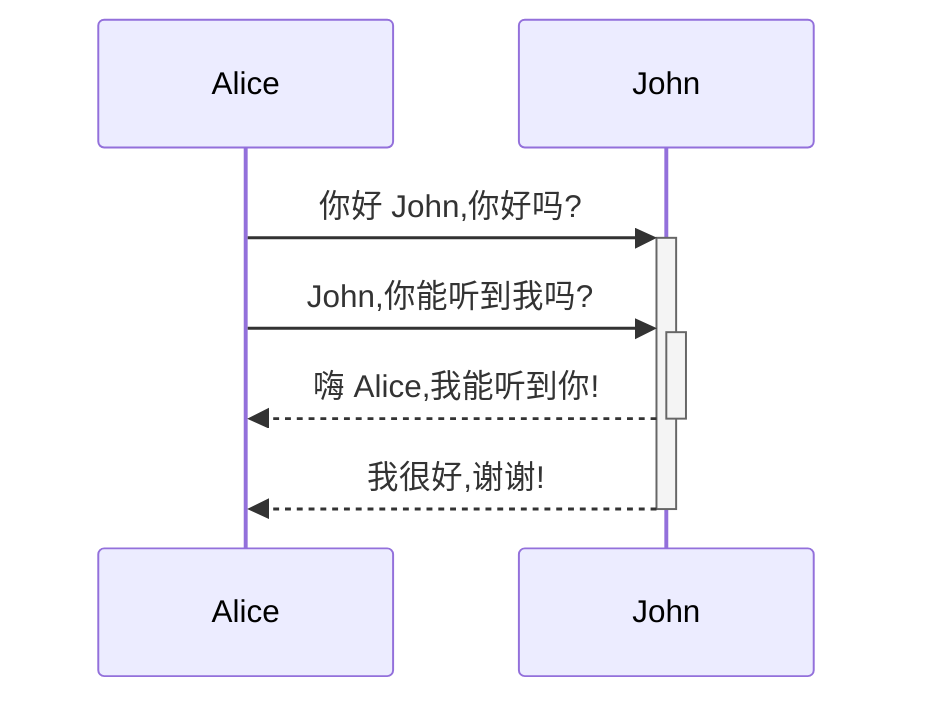

Quartz 支持使用 [Mermaid](https://mermaid.js.org/) 语法创建图表。

## 语法

要创建 Mermaid 图表,使用带有 `mermaid` 语言标识符的代码块:

````markdown

````

这将生成:


## 自定义

Mermaid 图表是 [[ObsidianFlavoredMarkdown]] 插件的功能。查看插件页面了解如何启用或禁用它们。 